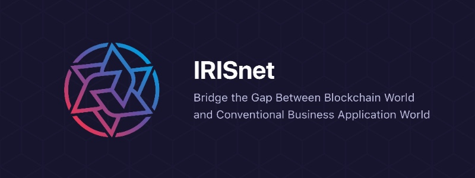

# IRISHub

IRIS network (a.k.a. IRISnet) aims to establish a technology foundation to facilitate construction of next-generation distributed applications. By incorpo- rating a comprehensive service infrastructure and an enhanced IBC protocol into the Tendermint & Cosmos stack, IRISnet enables service interoperability as well as token transfers across an internet of blockchains.
As the centerpiece of IRISnet, IRIS Hub (a.k.a. IRIShub) will be the first regional hub connecting to the main Cosmos Hub, thus making IRISnet an inseparable part of the whole Cosmos network.

## Fuxi Testnet

To join the Fuxi testnet, follow 
[this guide](https://github.com/irisnet/irishub/blob/master/docs/get-started/README.md).

For status updates and genesis files, see the
[testnets repo](https://github.com/irisnet/testnets).

## Install

See the 
[install instructions](https://github.com/irisnet/irishub/blob/master/docs/get-started/Install-Iris.md).

## Resources

* Explorer：https://testnet.irisplorer.io 
* Faucet：https://testnet.irisplorer.io/#/faucet

