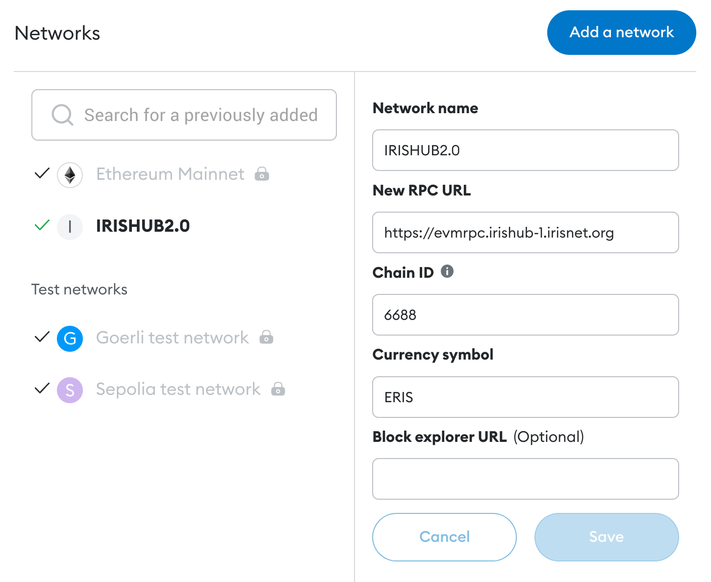

# EVM Smart Contract

Since the introduction of Ethereum in 2015, the ability to control digital assets through smart contracts has attracted a large community of developers to build decentralized applications on the Ethereum Virtual Machine.

Whether you are building new use cases on IRISHub or porting an existing dApp from another EVM-based chain (e.g. Ethereum, Evmos), you can easily build and deploy EVM smart contracts on IRISHub to implement the core business logic of your dApp. IRISHub is fully compatible with the EVM, so it allows you to use the same tools (Solidity, Remix, Oracles, etc.) and APIs (i.e. Ethereum JSON-RPC) that are available on the EVM.

Leveraging the interoperability of Cosmos chains, IRISHub enables you to build scalable cross-chain applications within a familiar EVM environment. Learn about the essential components when building and deploying EVM smart contracts on IRISHub below.

## Build Smart Contract with Solidity

You can develop EVM smart contracts on IRISHub using [Solidity](https://docs.soliditylang.org/en/latest/), which is also used on Ethereum. If you have deployed smart contracts on Ethereum or any other EVM-compatible chain, you can use the same contracts on IRISHub.

Since it is the most widely used smart contract programming language in Blockchain, Solidity comes with well-documented and rich language support.

## Prepare Account for EVM

You might already have an EVM account and hold its mnemonic phrase, but in IRISHub, EVM accounts are displayed with the `iaa` prefix.

### Generate or Recover EVM account in IRIShub

```bash
iris keys add <key-name> --algo eth_secp256k1

# or you can choose to recover one
iris keys add <key-name> --algo eth_secp256k1 --recover
```

### Import/Export EVM private key

You can import the private key of an EVM account to generate an iaa account on IRISHub with the following command:

```bash
iris keys unsafe-import-eth-key <key-name> <private-key>
```

Conversely, you can export the EVM private key of an iaa account using the following command:

```bash
iris keys unsafe-export-eth-key <key-name>
```

### Exchange ERIS in IRISHub


IRISHub uses `eris` as the EVM token, which is pegged 1:1 with `iris`. You can exchange them using the following command:

```bash
iris tx token swap-fee 100iris --from <sender> --to <recipient>

> balances:
  - denom: eris
    amount: "100.000000000000000000"
```

## Deploy Smart Contract with Remix

**Remix** is an in-browser IDE for Solidity smart contracts. In this guide, we will learn how to deploy a contract to a running Ethermint network through Remix and interact with it.

### Add Network with Metamask

Before we use Remix to develop and deploy smart contracts, we could first add a custom network for IRISHub with [Metamask](https://metamask.io/). 

Open the Metamask extension on your browser, you may have to log in to your Metamask account if you are not already. 

Then click the top right circle and go to `Settings > Networks`. Press the `Add Network` button and fill the form as the example below with your application ChainID:

- Network Name: IRISHub 2.0
- RPC URL: https://evmrpc.irishub-1.irisnet.org
- ChainID: 6688
- Symbol: ERIS



Now you can export your private key from the terminal using the following command:

```bash
iris keys unsafe-export-eth-key <key-name>
```

Go back to the browser and select the Private Key option. Then paste the private key exported from the `unsafe-export-eth-key` command.

### Connect IRIShub account to Remix

Start your IRISHub daemon and rest server, or just connect to the remote server, based on your network configuration.

Once that is complete, go to [Remix](http://remix.ethereum.org/). There are some contracts in the **File Explorer**. Select any of these contracts. On the left-most bar, select the **Solidity compiler** and compile the contract.

Next, select the **Deploy and run transaction**. Note you should change the environment to **Injected Provider**. This will open a Metamask popup for you to confirm connecting your Metamask to Remix.

### Deploy and Interact

Now that your account is connected, you are able to deploy the contract. Press the Deploy button. A metamask pop-up will appear asking you to confirm. Confirm the transaction.

Once the contract has been successfully deployed, you will see it show up in the **Deployed Contracts** section in the left-hand side, as well as a green check in the Remix console showing the transaction details.

