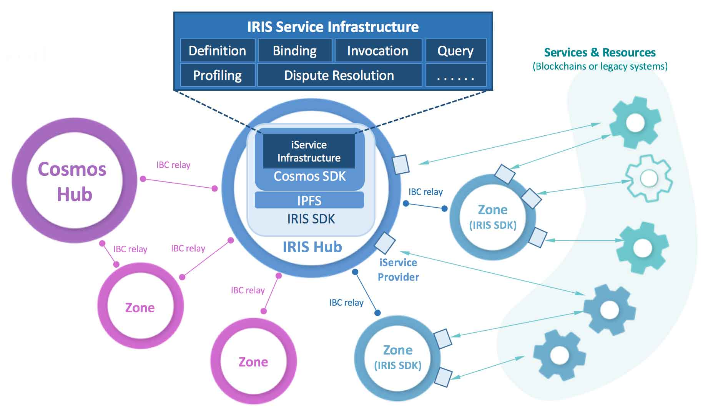

# 简介

## IRIS 网络

IRIS网络是一个区块链互联网，它旨在提供便于构建分布式商业应用程序的技术基础。

IRIS网络是更大的Cosmos网络的一部分 - 网络中所有分区都能够通过标准IBC协议与Cosmos网络中的任何其他分区进行交互。通过在网络中引入一层服务语义，我们将提供一种创新的解决方案，支持全新的业务场景，从而增加Cosmos网络的规模和多样性。

## IRIS 枢纽

在IRIS网络的“中心”是一个称为 *IRIS枢纽* 的区块链，它是一个基于Cosmos SDK和Tendermint构建的Proof-of-Stake（PoS）区块链。它将成为第一个连接Cosmos枢纽的区域性枢纽。IRIS枢纽配备了服务协议，该协议将链上的交易处理与链下的数据处理和业务逻辑执行进行协调。我们还增强了IBC协议，以促进那些链下服务在有需要的情况下被跨链调用。

服务协议和增强的IBC协议最终可以回馈到Cosmos SDK中，允许SDK用户开发与IRIS网络兼容的区块链。

我们也会提供面向客户的、针对特定编程语言的SDK，方便在IRIS网络内轻松提供和使用链下服务。

## IRIS 通证

IRIS枢纽有自己的原生通证，称为 *IRIS*，在网络中有三个作用。

* **抵押。** 与Cosmos Hub中的ATOM通证类似，IRIS通证将用作抵押通证以保护PoS区块链的安全运行。

* **交易费用。** IRIS通证也将用于支付IRIS网络中所有交易的费用。

* **服务费。** IRIS网络中的服务提供者需要以IRIS通证为单位收取服务费。

IRIS网络最终将支持来自Cosmos网络的所有列入白名单的费用通证，它们可用于支付交易费用和服务费用。

## IRIS 服务

引入 *IRIS服务*（又名“iService”）的目标是弥合区块链世界与传统商业应用世界之间的鸿沟，居中协调链下服务的整个生命周期 - 从定义，绑定（提供者注册），调用，直到它们的治理（描画和仲裁）。

### 生命周期

* **定义：**根据接口定义语言（IDL）文件定义链下iService可以做什么。

* **绑定：**声明实现给​​定iService定义的提供者端点的位置（地址），定价和服务质量。

* **调用：**处理针对给定iService提供者端点的消费者请求以及相应的提供者响应。

### 提供者

*提供者* 是提供一个或多个iService定义实现的网络用户，通常充当位于其他公有链、联盟链以及企业现有系统中的链下服务和资源的 *适配器*。它们监听和处理传入的请求，并将响应发送回网络。提供者可以通过向其他提供者发送请求来同时充当消费者。按照计划，提供者需要为他们可能提供的服务收取费用，默认情况下，服务费将以IRIS通证定价。

### 消费者

*消费者* 是那些使用iService的用户，他们向指定的提供者端点发送请求并接收相关提供者的响应。

### 分析员

*分析员* 是一种特殊用户，代表了发起建立IRIS网络的IRIS基金会有限公司（IRIS Foundation Limited），这是一家注册在香港的股份有限公司。分析员是在分析模式中调用iService的唯一授权用户，旨在帮助创建和维护服务提供者的分析画像，通过这些客观的分析画像服务消费者可以选择合适的服务提供者。

### 仲裁员

*仲裁员* 是自我声明的一类用户，他们协助消费者对投诉（服务提供者的表现）进行仲裁。有关仲裁机制的细节正在积极设计中，请关注我们的[白皮书](../resources/whitepaper.md)。
