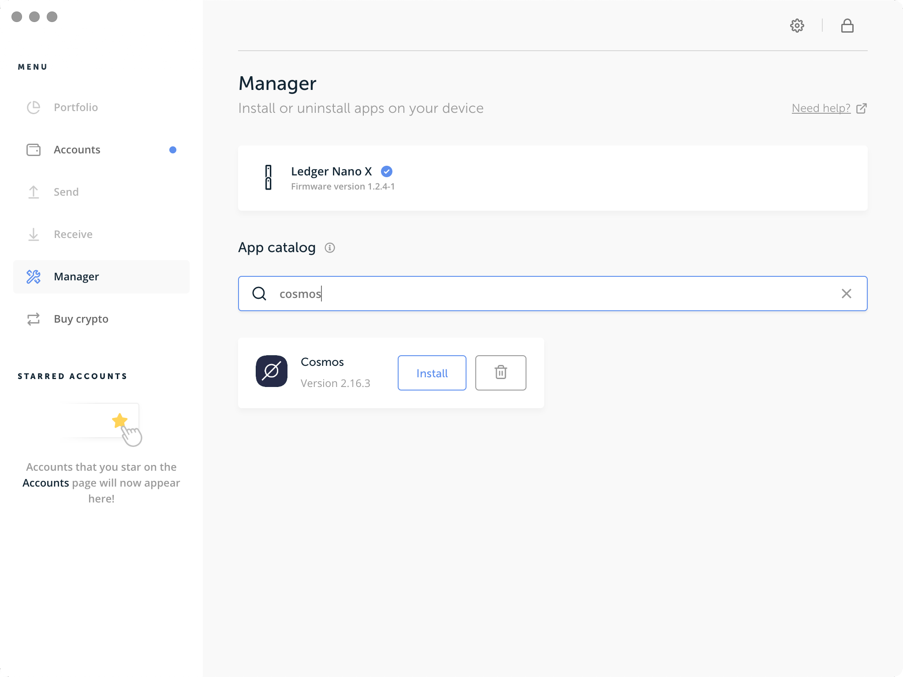

# Ledger Nano支持

建议在使用ledger之前对[IRISnet Key](../concepts/key.md)进行一个基本的了解。

## Ledger支持账户密钥

在Ledger设备的核心，有一个用于生成私钥的助记词。初始化Ledger时，会生成助记词。

::: danger
**不要丢失或与任何人分享你的24个单词。为防止盗窃或资金损失，最好确保保留多个助记词副本，并将其存放在安全可靠的地方，并且只有你知道如何访问。如果有人能够访问你的助记词，他们将能够访问你的私钥并控制与其关联的帐户。**
:::

该助记词与IRISnet兼容，用于在IRISnet网络上生成地址和交易的工具是`iris`，它支持从Ledger种子派生帐户密钥。请注意，Ledger设备充当种子和私钥的保护，并且签名交易发生在其中。没有任何私人信息会在Ledger设备之外被获取。

要通过Ledger设备使用`iris`，你需要采取下面步骤（因为IRISnet基于cosmos-sdk，COSMOS应用程序可用于IRISnet）：

- [在Ledger Nano中安装`COSMOS`应用程序并且创建一个账户。](#using-a-ledger-device)
- [一个连接在区块链网络上的`iris`全节点](../get-started/mainnet.md)
- [一个已配置`iris`（且已经连接到`iris`全节点）的实例。](../cli-client/intro.md)

至此可以在网络上发送交易。

在ledger设备的核心，有一个助记词用于在多个区块链（包括IRISnet）上生成帐户。通常，在初始化ledger设备时，将创建新的助记词。

接下来，了解如何生成帐户。

## 创建账户

要创建一个帐户，只需要安装`iris`。在创建它之前，需要知道你打算存储私钥的位置以及与私钥的交互。最好的选择是将它们存储在离线专用计算机或ledger设备中。将它们存储在你的常规联网的计算机上会带来更大的风险，因为任何通过互联网侵入你的计算机的人都可以获取你的私钥并窃取你的资金。

### 使用ledger设备

::: warning
仅使用购买的新设备或完全信任的Ledger设备
:::

初始化ledger时，会生成一个24个单词的助记词并存储在设备中。此助记词与IRISnet兼容，可以从中派生出IRISnet账号。因此，你所要做的就是让你的ledger与`iris`兼容。为此，你需要执行以下步骤：

1. 在你的机器上安装[Ledger Live](https://www.ledger.com/pages/ledger-live)。
2. 使用Ledger Live，[更新至最新的firmware](https://support.ledger.com/hc/en-us/articles/360002731113-Update-device-firmware)。
3. 在Ledger Live应用中，导航到`Manager`菜单。
4. 连接你的Ledger Nano设备并允许Ledger Manager接入。
5. 在Ledger Live应用中，搜索`Cosmos`. 
    
6. 点击`Install`安装Cosmos应用程序.

然后，要创建帐户，请使用以下命令：

```bash
iris keys add <keyName> --ledger
```

IRISnet使用[分层确定性钱包](../concepts/key.md）。这意味着你可以使用相同的Ledger种子派生出多个帐户。通过Ledger设备创建另一个帐户，请运行（将整数i更改为某个 >=0 的值以用于HD推导账户）：

```bash
iris keys add <secondKeyName> --ledger --account <i>
```

### 发送交易

现在你可以开始签名和发送交易了。以下是使用iris发送转账交易的示例。

```bash
iris tx bank send --help # to see all available options.
```

::: tip 在尝试运行以下命令之前，请确保使用PIN解锁你的设备并打开Cosmos应用程序 :::

使用你为Ledger密钥设置的keyName，iris将与Cosmos Ledger应用程序连接以签名交易。

::: tip Cosmos应用程序现在仅支持amino-json签名模式，你必须添加标志`--sign-mode amino-json`才能使用 :::

```bash
iris tx send <keyName> <destinationAddress> <amount><denomination> --sign-mode amino-json
```

当提示您在签名前确认交易时，键入Y。

接下来，在Ledger设备上将提示你审查及批准交易。确保检查屏幕上显示的JSON格式的交易。您可以滚动浏览每个字段和每个消息。

现在，你已经准备好开始[在网络上发送交易](../cli-client/tx.md)。